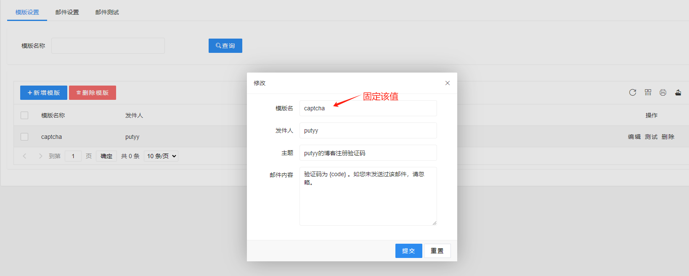
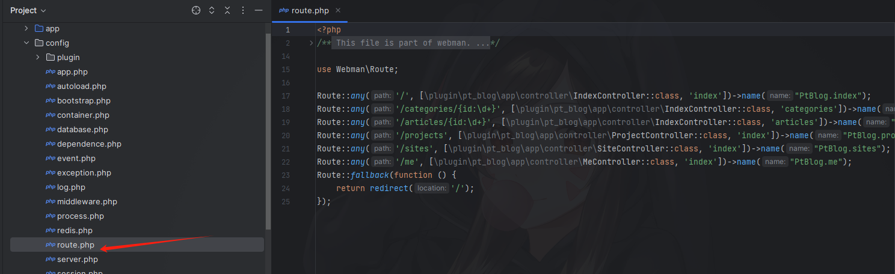

## 介绍

基于webman、webman-admin、tailwindcss、原生js 开发的响应式博客网站。

## 功能特性
- [x] 得益于tailwindcss，博客系统自适应pc、h5，支持一键切换主题色(黑暗模式)
- [x] 后台功能模块包括：文章标签、文章分类、文章管理、导航设置、系统配置、友情链接、项目管理等
- [x] 其他功能：个人主页、项目展示、友情链接、登录、注册、评论等

## 安装使用
1. 通过webman-admin后台安装本插件(或源码安装)及官方云邮件插件
>安装说明: https://www.workerman.net/app/view/email
模板示例:


2. 安装blade
> composer require psr/container ^1.1.1 webman/blade

3. 博客路由请根据自己需求手动添加至webman配置文件:
```php
Route::any('/', [\plugin\pt_blog\app\controller\IndexController::class, 'index'])->name("PtBlog.index");
Route::any('/categories/{id:\d+}', [\plugin\pt_blog\app\controller\IndexController::class, 'categories'])->name("PtBlog.categories");
Route::any('/articles/{id:\d+}', [\plugin\pt_blog\app\controller\IndexController::class, 'articles'])->name("PtBlog.articles");
Route::any('/projects', [\plugin\pt_blog\app\controller\ProjectController::class, 'index'])->name("PtBlog.projects");
Route::any('/sites', [\plugin\pt_blog\app\controller\SiteController::class, 'index'])->name("PtBlog.sites");
Route::any('/me', [\plugin\pt_blog\app\controller\MeController::class, 'index'])->name("PtBlog.me");
```
示例:

4. github授权配置 callback url选项示例：https://www.putyy.com/app/pt_blog/user/github  (非必须)

5. 重启webman 到这里就可以愉快的使用本系统了！

## 在线预览
[https://www.putyy.com/](https://blog.putyy.com/)
